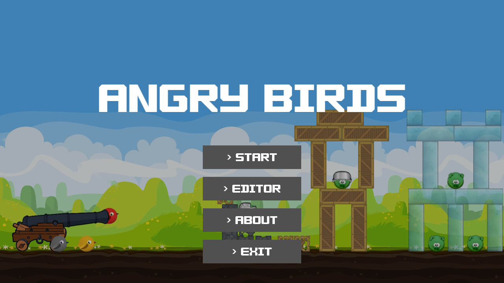
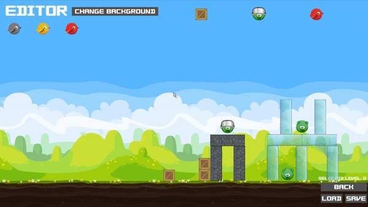

# PROI Project - "Angry Birds Remake":

## Table of Contents
* [Last update](#last-update).
* [About authors](#about authors).
    * [Tools and libraries](#used-tools-and-libraries).
* [Installation](#installation).
    * [Linux](#linux)
    * [macOS](#macos).
* [General](#general).
* [Game](#game).
    * [How to play](#how-to-game).
    * [Controls](#controls).
* [Level editor](#level-editor).
    * [How to edit](#how-edit).
        * [Actions in toolbar](#actions-in-toolbar).
        * [Actions in the game window](#actions-in-game-window).
        * [Save and load](#save-and-load).
* [Project structure](#project-structure).
* [Credits and sources](#resources).

---
## Last update
The last things that was changed in the project are:
* sounds were added
* menus were improved
* game bugs were fixed


## About authors
Authors:
- Piotr Patek
    * e-mail: piotr.patek.stud@pw.edu.pl
    * gitlab: @ppatek

- Jakub Wróblewski
    * e-mail: jakub.wroblewski4.stud@pw.edu.pl
    * gitlab: @jwroblew


### Tools and libraries used
- **SFML** - graphical interface and user interface + audio
- **Box2D** - physics engine
- **Catch2** - unit tests
- **nlohmann/json** - library that supports parsing of `.json` files.


## Installation
To install the project, clone the repository and build the project using `CMake`. It is required to have **SFML** library version 2.5.1 and **Box2D** version 2.4.1. In case of compilation problems, check if the paths to the libraries are set correctly in the `CMakeLists.txt` file.

```bash
git clone --recurse-submodules -j8 https://gitlab-stud.elka.pw.edu.pl/ppatek/angrybirds.git
cd angrybirds
mkdir build
cd build
cmake ...
make
```

To compile the project, you need to install **SFML** beforehand. Depending on the operating system you are using, you can do this by typing:
### Linux
```bash
sudo apt-get update
sudo apt-get install libsfml-dev
```
### macOS
On macOS, it is recommended to use `brew` to install **SFML**. You can get more information about installing `brew` on your device here: [https://brew.sh/](https://brew.sh/)
```bash
brew install sfml
```

If **SFML** is already installed on your computer, it should be findable under this path depending on your operating system:
* **Linux:** `/usr/include/SFML`.
* **macOS:** `/opt/homebrew/Cellar/sfml/2.5.1_2/include`.


## General:
According to the project's assumptions, a 2D game was developed, resembling in its functionality the popular "Angry Birds", with implemented physical engine and graphical interface.
In addition, the application has the ability to edit levels and has a layer of persistence by allowing writing and reading levels to and from a `.json` file.



## Game:
The game "Angry Birds Remake" consists of a dozen levels with the possibility of expanding with new levels using the level editor. Levels when created in the editor are saved to `.json` files, and then, during the course of the game, they are loaded into the game accordingly. The file contains information about the selected map, the distribution of blocks and pigs and their type, as well as the pool of birds available in that level.

### How to play:
In the game we have two modes available:
- **adventure** - adventure mode, in which the player has 14 predefined levels to go through, each of which is more difficult than the previous one.
- **custom** - a mode in which the player can play self-created levels. There are 5 slots available for saved levels.

By knocking down blocks or pigs, points are awarded, the amount of which is visible in the upper right corner of the game, as well as after passing the level in the results window. Once all the birds have been shot, the player can restart the level or move on to the next one. The condition for success is to defeat all pigs on the board. If all levels are passed, the player is taken to the main menu.

<figure class="video_container">
  <video controls="false" allowfullscreen="false" poster="textures/readme/ab_game.gif" width="100%" autoplay loop muted>
    <source src="textures/readme/game.mp4" type="video/mp4">.
    <source src="textures/readme/game.webm" type="video/webm">.
    
  </video>
</figure>

### Controls:
- **mouse** - setting the angle of the shot.
- **left mouse button** - launch the bird (holding down the mouse increases the power of the shot).
- **right mouse button** - activating the bird's special skill (if available).
- **middle mouse button** - change the bird (if another bird is available).
- **Escape key** - return to the menu.

## Level editor:
The level editor is a part of the main application. The whole thing works in a graphical user interface. In it it is possible to create new levels or edit currently existing boards. We can play these levels in "Custom" mode.

### How to edit?
In the editor we have several tools available:
- **block** - adds a block to the board.
- **pig** - adds a pig to the board.
- **bird** - adds a bird to the pool of available birds.
- **background change** - changes the background of the board.

<figure class="video_container">
  <video controls="false" allowfullscreen="false" poster="textures/readme/ab_editor.gif" width="100%" autoplay loop muted>
    <source src="textures/readme/editor.mp4" type="video/mp4">.
    <source src="textures/readme/editor.webm" type="video/webm">.
    
  </video>
</figure>

#### Toolbar Actions:
- **left mouse button** - select a particular block, pig or bird.
- **right mouse button** - change the type of block, pig or bird

#### Actions in the editor window:
- **left mouse button** - add a block, pig or bird to the board, depending on the selection in the toolbar.
- **mouse drag** - move a block or pig across the board.
- **right mouse button** - removing a block, pig or bird from the board.
- **center mouse button / R key** - rotate block, pig or bird.

#### Saving and loading:
- **up arrow** - increase the number of the saved level.
- **down arrow** - decreasing the number of the saved level
- **save** - after selecting the save option, the level is saved to `.json` file.
- **load** - when the load option is selected, the level is loaded from the file `.json`.

## Project structure

The whole application works on the principle of an automaton with a finite number of states. Depending on the current state, appropriate resources are loaded into the program, and the application displays a different window. All windows inherit from the `State` class, which is an abstract class. All windows are stored in a container `std::vector<std::unique_ptr<State>> states`, which is a component variable of the `Game` class. Depending on the current state, the corresponding window is displayed. All windows are displayed in a `while` loop in the `Game::run()` function. In each iteration of the loop, the current window is drawn on the screen, and then it is checked whether there has been a change of state. If so, the current window is removed and a new window is added to the `states` container. All windows are stored in the `std::unique_ptr` container, so we don't have to worry about releasing them from memory. All windows are created in the `Game::init()` function.

The application uses managers that are responsible for managing data. There are 3 managers used in the application:
- `entity_manager` - manages all objects that are displayed on the screen. All objects are inherited from the `Entity` class, which is an abstract class. All objects are stored in a container `std::vector<std::unique_ptr<Entity>> entities`.
- `gui_manager` - manages all objects that are displayed on the screen. It is used to create all the buttons and texts that are displayed on the screen.
- `sound_manager` - manages all the sounds that are used in the application.

The creative factory design pattern was implemented in the application. In addition, in order to optimize the code, separate factory classes were not created for each type of `Entity`, but it was decided to use templates. There are 3 factories that are responsible for creating objects:
- `bird_factory` - is the factory that is responsible for creating birds. All birds inherit from the `Bird` class, which is an abstract class.
- `box_factory` - is a factory that is responsible for creating blocks. All blocks inherit from the `Box` class, which is an abstract class.
- `pig_factory` - is a factory that is responsible for creating pigs. All pigs inherit from the `Pig` class, which is an abstract class.

## Sources:
The font used in the project was made by Gangetsha Lyx and is licensed under CC BY-SA 3.0.

Music and sounds are taken from the game "Angry Birds" by Rovio Entertainment Corporation and the game "Bad Piggies" by Rovio Entertainment Corporation.

Textures are inspired from graphics available on the Internet.

All resources are used for educational purposes and are not used for commercial purposes.